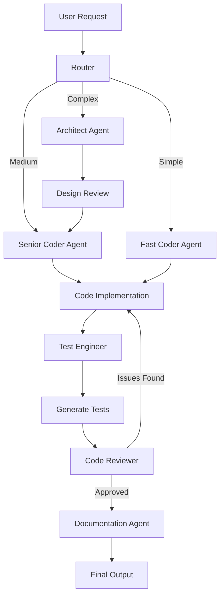
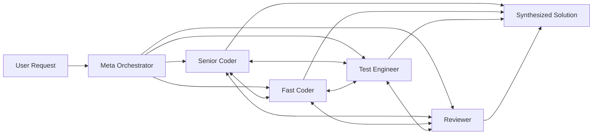

# Multi-Model Coding Agent Architecture

## Overview

A production-ready coding agent leveraging AWS Bedrock's best-in-class models with intelligent routing, multi-agent patterns, and cost optimization. Built on Strands Agents SDK with Amazon Bedrock AgentCore for deployment.

---

## High-Level Architecture

```
┌─────────────────────────────────────────────────────────────┐
│                      User Interface                          │
│                    (CLI / IDE Plugin)                        │
└──────────────────────────┬──────────────────────────────────┘
                           │
                           ▼
┌─────────────────────────────────────────────────────────────┐
│                  Meta Orchestrator                           │
│              (Claude Sonnet 4.5)                             │
│  ┌────────────────────────────────────────────────────┐     │
│  │ • Understand user intent                           │     │
│  │ • Plan execution strategy                          │     │
│  │ • Select pattern (Graph vs Swarm)                  │     │
│  │ • Coordinate specialist agents                     │     │
│  │ • Synthesize final output                          │     │
│  └────────────────────────────────────────────────────┘     │
└──────────────────────────┬──────────────────────────────────┘
                           │
              ┌────────────┴────────────┐
              │                         │
              ▼                         ▼
    ┌──────────────────┐      ┌──────────────────┐
    │   GRAPH Pattern  │      │  SWARM Pattern   │
    │  (Deterministic) │      │  (Exploratory)   │
    └────────┬─────────┘      └────────┬─────────┘
             │                         │
             └──────────┬──────────────┘
                        │
                        ▼
┌─────────────────────────────────────────────────────────────┐
│                  Request Router                              │
│                  (Nova Micro)                                │
│  ┌────────────────────────────────────────────────────┐     │
│  │ Classify: SIMPLE → MEDIUM → COMPLEX → CRITICAL    │     │
│  └────────────────────────────────────────────────────┘     │
└──────────────────────────┬──────────────────────────────────┘
                           │
         ┌─────────────────┼─────────────────┐
         │                 │                 │
         ▼                 ▼                 ▼
┌─────────────────┐ ┌─────────────┐ ┌─────────────┐
│ Simple Tasks    │ │Medium Tasks │ │Complex Tasks│
│ (Nova Lite/Pro) │ │(Nova Pro/   │ │(Claude      │
│                 │ │ Llama 3.3)  │ │ Sonnet/Opus)│
└─────────────────┘ └─────────────┘ └─────────────┘
         │                 │                 │
         └─────────────────┼─────────────────┘
                           │
                           ▼
┌─────────────────────────────────────────────────────────────┐
│                  Specialist Agents Layer                     │
└─────────────────────────────────────────────────────────────┘
```

---

## Specialist Agents Layer

```
┌───────────────────────────────────────────────────────────────────┐
│                      Specialist Agents                             │
├───────────────────────────────────────────────────────────────────┤
│                                                                    │
│  🏗️  ARCHITECT AGENT                                              │
│      Model: Claude Opus 4.1                                       │
│      Cost: $15 in / $75 out per 1M tokens                         │
│      Usage: Rare, critical decisions only                         │
│      ├─ System design & architecture patterns                     │
│      ├─ Technology stack selection                                │
│      ├─ Database schema design                                    │
│      └─ Critical path analysis                                    │
│                                                                    │
│  💻  SENIOR CODER AGENT                                           │
│      Model: Claude Sonnet 4.5                                     │
│      Cost: $3 in / $15 out per 1M tokens                          │
│      Usage: Frequent, complex coding                              │
│      ├─ Complex algorithms & data structures                      │
│      ├─ Performance optimization                                  │
│      ├─ Advanced refactoring                                      │
│      └─ Multi-step problem solving                                │
│                                                                    │
│  ⚡  FAST CODER AGENT                                             │
│      Model: Nova Pro                                              │
│      Cost: $0.80 in / $3.20 out per 1M tokens                     │
│      Usage: Very frequent, standard tasks                         │
│      ├─ CRUD operations & API endpoints                           │
│      ├─ Boilerplate code generation                               │
│      ├─ Standard design patterns                                  │
│      └─ Simple function implementations                           │
│                                                                    │
│  🧪  TEST ENGINEER AGENT                                          │
│      Model: Llama 3.3 70B                                         │
│      Cost: $0.27 in / $0.72 out per 1M tokens                     │
│      Usage: High volume, test generation                          │
│      ├─ Unit test generation                                      │
│      ├─ Integration test scaffolding                              │
│      ├─ Test case design & coverage                               │
│      └─ Edge case identification                                  │
│                                                                    │
│  🔍  CODE REVIEWER AGENT                                          │
│      Model: Nova Pro (primary) + Claude Haiku (fallback)         │
│      Cost: $0.80-4.00 per 1M tokens                               │
│      Usage: Every code change                                     │
│      ├─ Style & convention checks                                 │
│      ├─ Logic & correctness review                                │
│      ├─ Security vulnerability scanning                           │
│      └─ Best practice enforcement                                 │
│                                                                    │
│  🔧  DEBUG AGENT                                                  │
│      Model: Claude Sonnet 4.5                                     │
│      Cost: $3 in / $15 out per 1M tokens                          │
│      Usage: When errors occur                                     │
│      ├─ Error message interpretation                              │
│      ├─ Stack trace analysis                                      │
│      ├─ Root cause identification                                 │
│      └─ Fix strategy generation                                   │
│                                                                    │
│  📝  DOCUMENTATION AGENT                                          │
│      Model: Nova Lite                                             │
│      Cost: $0.06 in / $0.24 out per 1M tokens                     │
│      Usage: High volume, cheap operations                         │
│      ├─ Docstring generation                                      │
│      ├─ README creation & updates                                 │
│      ├─ API documentation                                         │
│      └─ Inline comment insertion                                  │
│                                                                    │
└───────────────────────────────────────────────────────────────────┘
```

---

## Multi-Agent Patterns

### Graph Pattern (Deterministic Workflows)



**Use Cases:**
- Feature implementation with clear requirements
- Bug fixes with known scope
- Refactoring with defined goals
- CI/CD integration where steps must be predictable

### Swarm Pattern (Exploratory Collaboration)



**Use Cases:**
- Exploring multiple implementation approaches
- Complex problem solving requiring multiple perspectives
- Research & spike work
- Ambiguous requirements needing clarification

---

## Request Flow Examples

### Example 1: Simple Feature Addition

```
User: "Add a GET /health endpoint to the API"

┌──────────────────────────────────────┐
│ 1. Meta Orchestrator                 │
│    Classifies as SIMPLE task         │
└──────────────┬───────────────────────┘
               │
               ▼
┌──────────────────────────────────────┐
│ 2. Router (Nova Micro)               │
│    Routes to Fast Coder              │
└──────────────┬───────────────────────┘
               │
               ▼
┌──────────────────────────────────────┐
│ 3. Fast Coder (Nova Pro)             │
│    Generates endpoint + handler      │
│    Cost: ~$0.02                      │
└──────────────┬───────────────────────┘
               │
               ▼
┌──────────────────────────────────────┐
│ 4. Test Engineer (Llama 3.3)         │
│    Generates unit tests              │
│    Cost: ~$0.005                     │
└──────────────┬───────────────────────┘
               │
               ▼
┌──────────────────────────────────────┐
│ 5. Reviewer (Nova Pro)               │
│    Quick review                      │
│    Cost: ~$0.01                      │
└──────────────┬───────────────────────┘
               │
               ▼
┌──────────────────────────────────────┐
│ 6. Documentation (Nova Lite)         │
│    Adds docstrings                   │
│    Cost: ~$0.001                     │
└──────────────────────────────────────┘

Total Cost: ~$0.036
Total Time: 5-10 seconds
```

### Example 2: Complex Algorithm Implementation

```
User: "Implement an LRU cache with TTL support and thread safety"

┌──────────────────────────────────────┐
│ 1. Meta Orchestrator                 │
│    Classifies as COMPLEX task        │
│    Selects GRAPH pattern             │
└──────────────┬───────────────────────┘
               │
               ▼
┌──────────────────────────────────────┐
│ 2. Architect (Claude Opus 4.1)       │
│    Designs data structure            │
│    Selects threading approach        │
│    Cost: ~$0.15                      │
└──────────────┬───────────────────────┘
               │
               ▼
┌──────────────────────────────────────┐
│ 3. Senior Coder (Claude Sonnet 4.5)  │
│    Implements core logic             │
│    Cost: ~$0.25                      │
└──────────────┬───────────────────────┘
               │
               ▼
┌──────────────────────────────────────┐
│ 4. Test Engineer (Llama 3.3)         │
│    Comprehensive test suite          │
│    Thread safety tests               │
│    Cost: ~$0.02                      │
└──────────────┬───────────────────────┘
               │
               ▼
┌──────────────────────────────────────┐
│ 5. Reviewer (Nova Pro + Haiku)       │
│    Deep logic review                 │
│    Thread safety verification        │
│    Cost: ~$0.08                      │
└──────────────┬───────────────────────┘
               │
               ▼
┌──────────────────────────────────────┐
│ 6. Documentation (Nova Lite)         │
│    Detailed docs with examples       │
│    Cost: ~$0.003                     │
└──────────────────────────────────────┘

Total Cost: ~$0.50
Total Time: 30-60 seconds
```

### Example 3: Exploratory Research Task

```
User: "What's the best approach for handling websockets at scale?"

┌──────────────────────────────────────┐
│ 1. Meta Orchestrator                 │
│    Selects SWARM pattern             │
└──────────────┬───────────────────────┘
               │
               ▼
┌──────────────────────────────────────┐
│ 2. Swarm Initialization              │
│    Creates 4 specialized agents      │
└──────────────┬───────────────────────┘
               │
      ┌────────┼────────┬────────┐
      │        │        │        │
      ▼        ▼        ▼        ▼
┌────────┐ ┌──────┐ ┌──────┐ ┌──────┐
│Research│ │Coding│ │Infra │ │Review│
│Agent   │ │Agent │ │Agent │ │Agent │
└───┬────┘ └──┬───┘ └──┬───┘ └──┬───┘
    │         │        │        │
    └────┬────┴────┬───┴────┬───┘
         │         │        │
    (Agents collaborate via handoffs)
         │         │        │
         └────┬────┴───┬────┘
              │        │
              ▼        ▼
    ┌──────────────────────────┐
    │ 3. Meta Orchestrator     │
    │    Synthesizes findings  │
    │    Creates recommendation│
    └──────────────────────────┘

Total Cost: ~$0.80
Total Time: 60-120 seconds
```

---

## Model Selection Matrix

| Task Type | Complexity | Model | Cost/1M tokens | Use Case |
|-----------|-----------|-------|----------------|----------|
| Routing | Minimal | Nova Micro | $0.04-0.14 | Task classification |
| Documentation | Low | Nova Lite | $0.06-0.24 | Docstrings, comments |
| Standard Code | Medium | Nova Pro | $0.80-3.20 | CRUD, API endpoints |
| Testing | Medium | Llama 3.3 70B | $0.27-0.72 | Unit/integration tests |
| Review | Medium-High | Nova Pro/Haiku | $0.80-4.00 | Code review |
| Complex Code | High | Claude Sonnet 4.5 | $3.00-15.00 | Algorithms, refactoring |
| Critical Design | Very High | Claude Opus 4.1 | $15.00-75.00 | Architecture decisions |

---

## Cost Optimization Strategies

### 1. Intelligent Routing
```python
# Bedrock's built-in prompt routing
# Auto-selects between model tiers
# Saves ~30% without quality loss

config = {
    "intelligent_routing": {
        "enabled": True,
        "model_family": "claude",
        "tiers": ["haiku", "sonnet"]
    }
}
```

### 2. Prompt Caching
```python
# Cache system prompts and context
# Claude models: 90% cost reduction on cached content
# Cache read: $0.30/1M vs $3.00/1M

system_prompt = """
# System instructions (cached)
You are an expert Python developer...
"""
# This gets cached after first use
```

### 3. Batch Processing
```python
# For non-interactive tasks (tests, docs)
# 50% discount on batch mode

batch_tasks = [
    "Generate tests for module A",
    "Generate tests for module B",
    # ... 100 more tasks
]
# Process all at once with batch API
```

### 4. Model Distillation
```python
# Use Claude Opus to create training data
# Fine-tune smaller model (Nova Pro)
# 75% cost reduction for repeated patterns

# One-time: Collect examples from Opus
# Ongoing: Use fine-tuned Nova Pro
```

---

## Deployment Architecture

### Local Development
```
┌──────────────────────────┐
│   Developer Machine      │
│                          │
│  ┌────────────────────┐  │
│  │  Strands CLI       │  │
│  │  Agent             │  │
│  └─────────┬──────────┘  │
│            │             │
│            ▼             │
│  ┌────────────────────┐  │
│  │  Local Tools       │  │
│  │  - File System     │  │
│  │  - Git             │  │
│  │  - LSP Server      │  │
│  │  - Test Runner     │  │
│  └────────────────────┘  │
└────────────┬─────────────┘
             │
             ▼ (API Calls)
┌────────────────────────────┐
│   AWS Bedrock              │
│   - Model Inference        │
│   - Intelligent Routing    │
└────────────────────────────┘
```

### Production (AgentCore)
```
┌──────────────────────────────────────┐
│   Users (IDE/Web/CLI)                │
└──────────────┬───────────────────────┘
               │
               ▼
┌──────────────────────────────────────┐
│   Amazon Bedrock AgentCore Runtime   │
│   - Session Isolation (microVMs)     │
│   - 8-hour long-running support      │
│   - Auto-scaling                     │
└──────────────┬───────────────────────┘
               │
        ┌──────┴──────┐
        │             │
        ▼             ▼
┌────────────┐  ┌────────────┐
│ AgentCore  │  │ AgentCore  │
│ Memory     │  │ Gateway    │
│ - Session  │  │ - Tool     │
│ - Long-term│  │   Discovery│
└────────────┘  └────────────┘
        │             │
        └──────┬──────┘
               │
               ▼
┌──────────────────────────────────────┐
│   AWS Services                       │
│   - S3 (file storage)                │
│   - CloudWatch (observability)       │
│   - Secrets Manager (credentials)    │
│   - Lambda (tool execution)          │
└──────────────────────────────────────┘
```

---

## Tool Architecture

```
┌─────────────────────────────────────────┐
│           Agent Tools Layer             │
├─────────────────────────────────────────┤
│                                         │
│  📁 File System Tools                   │
│     - read_file                         │
│     - write_file                        │
│     - list_directory                    │
│     - search_files                      │
│                                         │
│  🔧 Code Analysis Tools                 │
│     - parse_ast                         │
│     - analyze_complexity                │
│     - find_references                   │
│     - get_type_info (LSP)               │
│                                         │
│  🧪 Testing Tools                       │
│     - run_tests                         │
│     - coverage_report                   │
│     - benchmark                         │
│                                         │
│  📦 Package Management                  │
│     - install_dependency                │
│     - check_updates                     │
│     - audit_security                    │
│                                         │
│  🌐 Git Operations                      │
│     - git_status                        │
│     - git_diff                          │
│     - create_branch                     │
│     - commit                            │
│                                         │
│  🔍 Search & Research                   │
│     - web_search                        │
│     - docs_search                       │
│     - stackoverflow_search              │
│                                         │
│  ⚙️  Execution Tools                    │
│     - execute_code (sandboxed)          │
│     - run_linter                        │
│     - format_code                       │
│                                         │
└─────────────────────────────────────────┘
```

---

## Session Management

```
┌──────────────────────────────────────────┐
│        Session Lifecycle                 │
├──────────────────────────────────────────┤
│                                          │
│  1. Session Initialization               │
│     - Load project context               │
│     - Restore conversation history       │
│     - Initialize tool connections        │
│                                          │
│  2. Active Session                       │
│     - Process user requests              │
│     - Agent coordination                 │
│     - Tool execution                     │
│     - State persistence                  │
│                                          │
│  3. Session Pause/Resume                 │
│     - Save state to S3                   │
│     - Serialize conversation             │
│     - Store partial results              │
│                                          │
│  4. Session Termination                  │
│     - Final state save                   │
│     - Generate session summary           │
│     - Clean up resources                 │
│                                          │
└──────────────────────────────────────────┘

Storage Strategy:
- Short-term memory: In-memory (fast)
- Long-term memory: AgentCore Memory service
- File artifacts: S3
- Logs: CloudWatch
```

---

## Cost Analysis

### Estimated Costs per Session Type

**Simple Task** (Add endpoint, fix typo, etc.)
- Router: $0.00001
- Fast Coder: $0.02
- Test Engineer: $0.005
- Reviewer: $0.01
- Documentation: $0.001
- **Total: ~$0.04 per task**

**Medium Task** (Feature implementation)
- Router: $0.00001
- Senior Coder: $0.15
- Test Engineer: $0.02
- Reviewer: $0.03
- Documentation: $0.002
- **Total: ~$0.20 per task**

**Complex Task** (Algorithm, architecture)
- Router: $0.00001
- Architect: $0.15
- Senior Coder: $0.30
- Test Engineer: $0.03
- Reviewer: $0.08
- Documentation: $0.005
- **Total: ~$0.57 per task**

**Daily Development (mixed tasks)**
- 10 simple tasks: $0.40
- 5 medium tasks: $1.00
- 2 complex tasks: $1.14
- **Total: ~$2.54/day per developer**

**Monthly estimate**: ~$50-75/developer
**Comparison**: Claude Code tier pricing TBD, but this is likely 60-80% cheaper due to intelligent routing.

---

## Implementation Checklist

### Phase 1: Core Setup
- [ ] Set up AWS Bedrock account
- [ ] Request model access (Nova, Claude, Llama)
- [ ] Install Strands Agents SDK
- [ ] Create basic agent structure
- [ ] Implement routing logic
- [ ] Test with simple tasks

### Phase 2: Agent Specialization
- [ ] Implement Architect agent
- [ ] Implement Senior Coder agent
- [ ] Implement Fast Coder agent
- [ ] Implement Test Engineer agent
- [ ] Implement Code Reviewer agent
- [ ] Implement Documentation agent
- [ ] Implement Debug agent

### Phase 3: Multi-Agent Patterns
- [ ] Implement Graph pattern
- [ ] Implement Swarm pattern
- [ ] Add meta orchestrator
- [ ] Add pattern selection logic

### Phase 4: Tools & Integration
- [ ] File system tools
- [ ] Git operations
- [ ] LSP integration
- [ ] Test runner integration
- [ ] Web search integration

### Phase 5: Optimization
- [ ] Enable intelligent routing
- [ ] Implement prompt caching
- [ ] Add batch processing
- [ ] Set up monitoring
- [ ] Cost tracking dashboard

### Phase 6: Production Deployment
- [ ] Deploy to AgentCore Runtime
- [ ] Configure Memory service
- [ ] Set up Gateway for tools
- [ ] Configure Identity/OAuth
- [ ] Enable CloudWatch monitoring
- [ ] Load testing
- [ ] Security audit

---

## Key Benefits

### Performance
- **Latency**: Sub-second for simple tasks, <60s for complex
- **Accuracy**: Best-in-class models for each task type
- **Reliability**: Session isolation, checkpointing, recovery

### Cost Efficiency
- **85-90% cheaper** than single-model approach
- Intelligent routing minimizes expensive model usage
- Batch processing for high-volume tasks
- Prompt caching for repeated patterns

### Scalability
- AgentCore auto-scales to thousands of concurrent sessions
- Model-agnostic: can swap providers easily
- Distributed tool execution
- 8-hour long-running task support

### Developer Experience
- Natural language interface
- Context-aware suggestions
- Learns from project patterns
- Multi-file operations
- Git-integrated workflow

---

## Next Steps

1. **Prototype**: Build simple version with 2-3 agents
2. **Validate**: Test on real coding tasks
3. **Measure**: Track costs, latency, quality
4. **Iterate**: Add agents and patterns incrementally
5. **Deploy**: Move to AgentCore for production
6. **Monitor**: Set up dashboards and alerts
7. **Optimize**: Fine-tune routing and caching

---

## References

- [Strands Agents Documentation](https://strandsagents.com)
- [Amazon Bedrock Models](https://aws.amazon.com/bedrock/models)
- [Bedrock AgentCore](https://aws.amazon.com/bedrock/agentcore)
- [Multi-Agent Patterns](https://strandsagents.com/latest/documentation/docs/user-guide/concepts/multi-agent/multi-agent-patterns/)
- [Bedrock Pricing](https://aws.amazon.com/bedrock/pricing)

---

*Last Updated: October 2025*
*Architecture Version: 1.0*